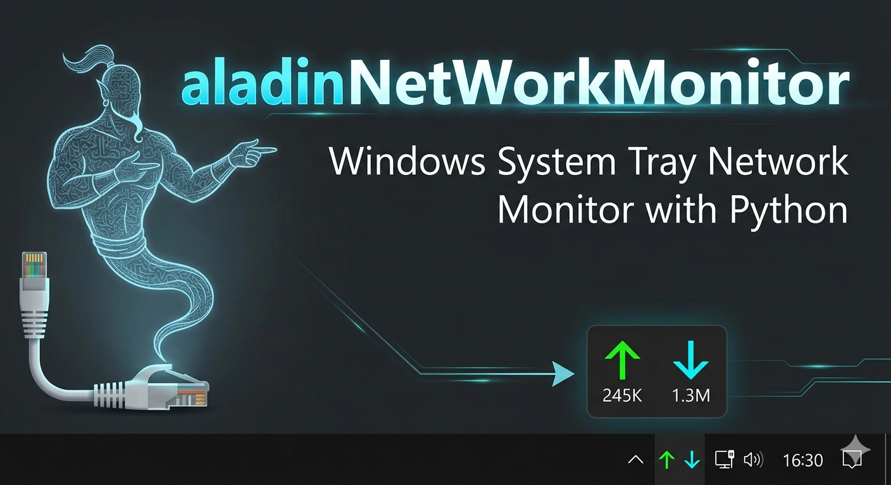

# aladinNetWorkMonitor
Windows System Tray Network Speed Monitor with Python (PySide6)
aladinNetWorkMonitor
English | Türkçe

English
    aladinNetWorkMonitor is a lightweight and stylish Python application that runs in the Windows System Tray, allowing you to monitor your internet traffic (Real-time Upload and Download speeds) live.

✨ Features
    Dual Icon Support: Choose between a single icon (stacked) or two separate icons side-by-side for massive, readable digits.
    
    Color-Coded Data: Instantly distinguish speeds with Green (↑) for Upload and Cyan (↓) for Download.
    
    Smart Unit Conversion: Automatically switches between KB/s and MB/s based on your speed.
    
    System Friendly: Powered by the psutil backend, it consumes negligible CPU and RAM.
    
    Customizable: Seamlessly toggle between view modes via the right-click menu.

🛠️ Installation
    Python 3.x must be installed on your computer.

Install required libraries:

    Bash
    pip install PySide6 psutil
Run the application:

    Bash
    python aladinNetWorkMonitor.py

Türkçe
    aladinNetWorkMonitor, Windows sistem tepsisinde (System Tray) çalışan, internet trafiğinizi (Anlık Upload ve Download hızı) canlı olarak takip etmenizi sağlayan hafif ve şık bir Python uygulamasıdır.

✨ Özellikler
    Çift İkon Desteği: İster tek bir ikonda üst üste, ister yan yana iki ayrı ikonla devasa rakamlarla hız takibi.
    
    Renk Kodlu Veri: Yeşil (↑) ile Upload, Mavi (↓) ile Download hızlarını anında ayırt edin.
    
    Akıllı Birim Dönüştürme: Hızınıza göre KB/s ve MB/s birimleri arasında otomatik geçiş yapar.
    
    Sistem Dostu: psutil altyapısı sayesinde işlemciyi ve RAM'i neredeyse hiç yormaz.
    
    Özelleştirilebilir: Sağ tık menüsü ile görünüm modları arasında anlık geçiş yapabilirsiniz.

🛠️ Kurulum
    Programı çalıştırmak için bilgisayarınızda Python 3.x yüklü olmalıdır.

Gerekli kütüphaneleri yükleyin:

    Bash
    pip install PySide6 psutil
Uygulamayı çalıştırın:

    Bash
    python aladinNetWorkMonitor.py
📝 Signature / İmza
    This project was designed by Aladin for developers and technical professionals to keep an eye on real-time network traffic.
    Bu proje Aladin tarafından, teknik profesyonellerin ağ trafiğini anlık takip edebilmesi için tasarlanmıştır.
